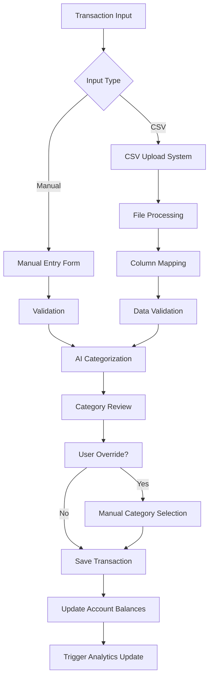
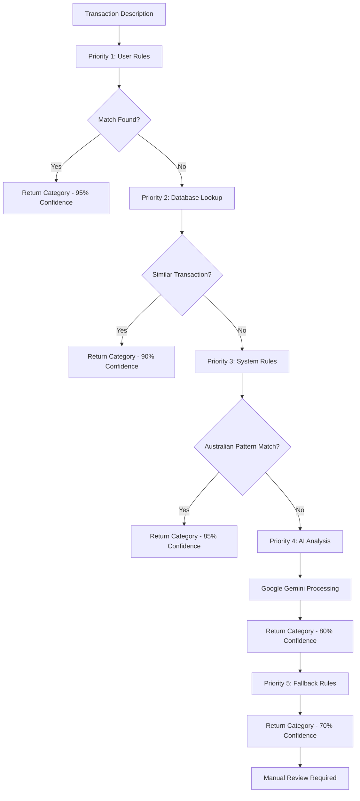
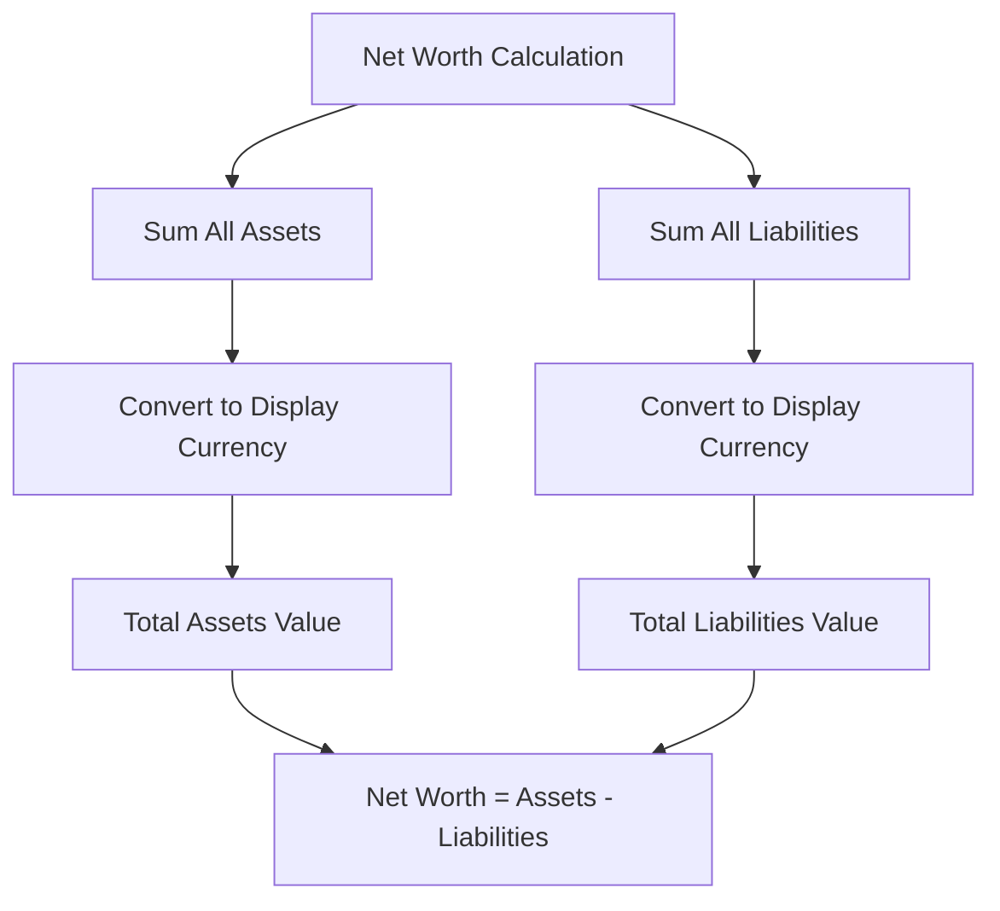
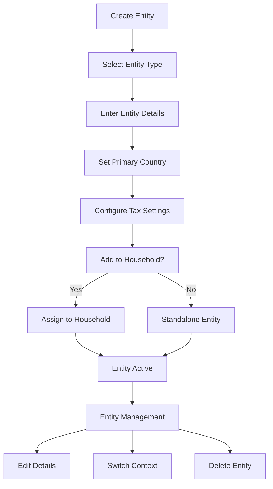
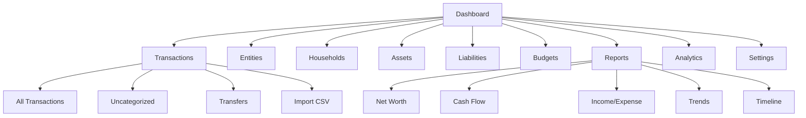
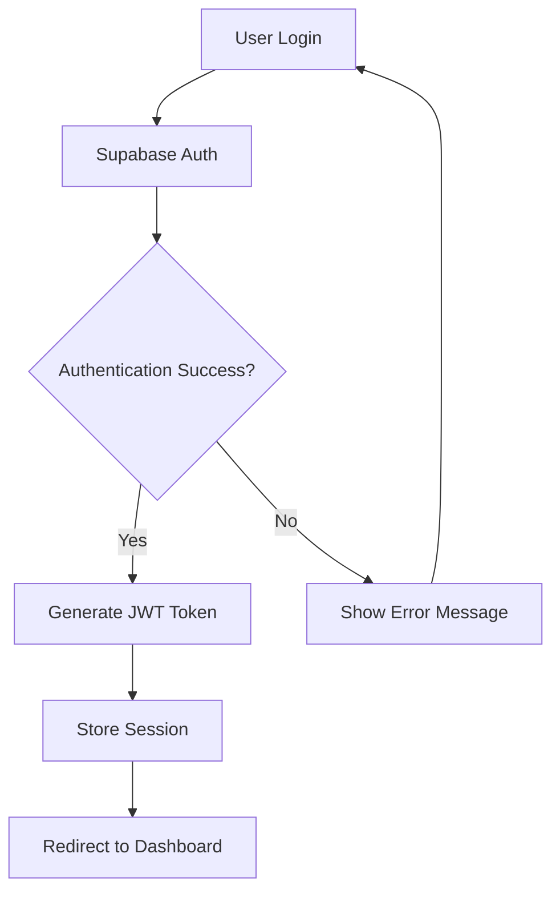
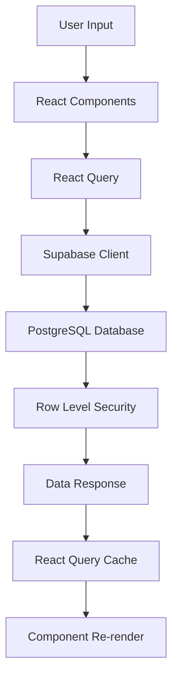
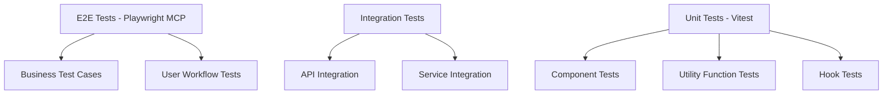

# 🧠 Pocket Penny Wizard - Comprehensive Wiki Mind Map

*Index your code with Devin | DeepWiki*

**Last indexed:** January 2025

## 📋 Table of Contents

- [Overview](#overview)
- [Application Architecture](#application-architecture)
- [Core Transaction System](#core-transaction-system)
- [CSV Upload and Processing](#csv-upload-and-processing)
- [AI Categorization System](#ai-categorization-system)
- [Transaction Display and Management](#transaction-display-and-management)
- [Manual Transaction Entry](#manual-transaction-entry)
- [Financial Management Features](#financial-management-features)
- [Assets and Liabilities Management](#assets-and-liabilities-management)
- [Budget Management and Analysis](#budget-management-and-analysis)
- [Entity Management](#entity-management)
- [User Interface and Navigation](#user-interface-and-navigation)
- [Dashboard and Analytics](#dashboard-and-analytics)
- [Authentication System](#authentication-system)
- [Data Processing and Management](#data-processing-and-management)
- [Category Management System](#category-management-system)
- [Search and Filtering](#search-and-filtering)
- [Data Types and Schema](#data-types-and-schema)
- [Development and Testing](#development-and-testing)
- [Testing Infrastructure](#testing-infrastructure)
- [Dependencies and Configuration](#dependencies-and-configuration)

---

## 🎯 Overview

**Relevant source files:**
- `src/App.tsx`
- `src/components/AppSidebar.tsx`
- `src/pages/Assets.tsx`
- `src/pages/Dashboard.tsx`
- `src/pages/Liabilities.tsx`

This document provides a comprehensive overview of the Pocket Penny Wizard financial management application, its architecture, core systems, and key features. The application is a full-stack web-based financial management platform built with React/TypeScript frontend and Supabase backend, featuring AI-powered transaction categorization, multi-currency support, and comprehensive asset-liability tracking.

For detailed implementation guides on specific subsystems, see Core Transaction System, Authentication System, Assets and Liabilities Management, or AI Categorization System.

### 🏗️ Application Architecture

Pocket Penny Wizard follows a modern web application architecture with clear separation between frontend presentation layer, backend services, and external integrations.

**Sources:** `src/App.tsx:1-251` `src/pages/Dashboard.tsx:1-213` `src/components/AppSidebar.tsx:1-233` `src/pages/Assets.tsx:1-286` `src/pages/Liabilities.tsx:1-293`

### 🎯 Core Features and Components

The application provides comprehensive financial management capabilities organized around several key functional areas:

| Feature Area | Primary Components | Key Functions |
|--------------|-------------------|---------------|
| **Transaction Management** | TransactionList, UnifiedCsvUpload | CSV import, manual entry, AI categorization |
| **Asset-Liability Tracking** | AssetsList, LiabilitiesList | Account management, balance calculation |
| **Financial Analytics** | Dashboard, CashFlowChart, CategoryPieChart | Real-time reporting, visualization |
| **Entity Management** | Entities, Households | Multi-entity financial tracking |
| **Authentication & Security** | AuthProvider, ProtectedRoute | OAuth, session management |
| **Multi-Currency** | CurrencyProvider, CurrencySelector | Exchange rates, currency conversion |

---

## 🔄 Core Transaction System

### Transaction Processing Pipeline



### Transaction Data Flow

**Relevant source files:**
- `src/services/categorization/TransactionCategorizer.ts`
- `src/services/categorization/TransactionProcessor.ts`
- `src/components/transaction-forms/UnifiedCsvUpload.tsx`
- `src/components/transactions/TransactionTable.tsx`

### Key Transaction Features

1. **Multi-Source Input**
   - Manual transaction entry
   - CSV file upload with intelligent column mapping
   - Excel file support (.xlsx, .xls)
   - Bulk transaction operations

2. **AI-Powered Categorization**
   - Google Gemini integration
   - Priority-based categorization system
   - Learning from user corrections
   - Australian merchant pattern recognition

3. **Data Validation**
   - Duplicate detection algorithms
   - Format validation
   - Currency conversion
   - Date normalization

---

## 📁 CSV Upload and Processing

### CSV Processing Pipeline

```mermaid
graph LR
    A[CSV File] --> B[File Validation]
    B --> C[Header Detection]
    C --> D[Column Mapping]
    D --> E[Data Preview]
    E --> F[User Review]
    F --> G[Batch Processing]
    G --> H[AI Categorization]
    H --> I[Category Review Dialog]
    I --> J[Import Confirmation]
    J --> K[Database Insert]
```



### Supported File Formats

| Format | Extension | Features |
|--------|-----------|----------|
| CSV | `.csv` | UTF-8 encoding, comma-separated |
| Excel | `.xlsx`, `.xls` | Multiple sheets, formatted cells |
| Bank Statements | Various | Australian banking formats |

### Column Mapping Intelligence

**Relevant source files:**
- `src/components/transaction-forms/csv-upload/ColumnMappingSection.tsx`
- `src/components/transaction-forms/csv-upload/AutoMappingAlert.tsx`
- `src/utils/csvParser.ts`

The system automatically detects common column patterns:
- **Date columns**: Various date formats (DD/MM/YYYY, YYYY-MM-DD)
- **Amount columns**: Currency symbols, decimal separators
- **Description columns**: Transaction descriptions, merchant names
- **Balance columns**: Account balances, running totals

---

## 🤖 AI Categorization System

### Categorization Priority System



### AI Integration Details

**Relevant source files:**
- `src/services/categorization/AICategorizer.ts`
- `src/services/categorization/SystemRulesCategorizer.ts`
- `src/services/categorization/UserRulesCategorizer.ts`
- `supabase/functions/categorize-transaction/index.ts`

### Google Gemini Configuration

```typescript
interface AICategorizationRequest {
  batchMode: boolean;
  descriptions: string[];
  userId: string;
  context?: {
    previousCategories: string[];
    userPreferences: string[];
  };
}
```

### Australian Merchant Patterns

The system includes 50+ hardcoded Australian merchant patterns:

| Category | Examples | Patterns |
|----------|----------|----------|
| **Supermarkets** | Coles, Woolworths, IGA | `coles`, `woolworths`, `iga` |
| **Transport** | Linkt, CityLink, EastLink | `linkt`, `citylink`, `eastlink` |
| **Entertainment** | Netflix, Spotify, Disney+ | `netflix`, `spotify`, `disney` |
| **Fuel** | Shell, BP, Caltex | `shell`, `bp`, `caltex` |
| **Utilities** | AGL, Origin, Telstra | `agl`, `origin`, `telstra` |

---

## 💳 Transaction Display and Management

### Transaction Table Features

**Relevant source files:**
- `src/components/transactions/TransactionTable.tsx`
- `src/components/transactions/TransactionTableRow.tsx`
- `src/components/transactions/TransactionSearch.tsx`
- `src/components/transactions/BulkEditActions.tsx`

### Advanced Search and Filtering

```typescript
interface TransactionFilters {
  dateRange: { start: Date; end: Date };
  categories: string[];
  amountRange: { min: number; max: number };
  description: string;
  account: string;
  currency: string;
}
```

### Bulk Operations

1. **Bulk Category Updates**
   - Select multiple transactions
   - Apply category changes
   - Batch processing with progress indicators

2. **Bulk Deletion**
   - Multi-select interface
   - Confirmation dialogs
   - Undo capability

3. **Export Operations**
   - CSV export with current filters
   - PDF reports
   - Excel format support

---

## ✏️ Manual Transaction Entry

### Transaction Form Components

**Relevant source files:**
- `src/components/transaction-forms/ManualTransactionForm.tsx`
- `src/components/transactions/ManualTransactionDialog.tsx`
- `src/components/transactions/EditTransactionDialog.tsx`

### Form Validation

```typescript
interface TransactionFormData {
  description: string;      // Required, min 3 characters
  amount: number;          // Required, non-zero
  date: Date;             // Required, not future
  category: string;       // Required, valid category
  account?: string;       // Optional account reference
  comment?: string;       // Optional notes
  currency: string;       // Default: AUD
}
```

### Real-time Validation

- **Amount validation**: Numeric input with currency formatting
- **Date validation**: Prevents future dates, validates format
- **Category validation**: Dropdown with search functionality
- **Duplicate detection**: Warns about potential duplicates

---

## 💰 Financial Management Features

### Multi-Entity Support

**Relevant source files:**
- `src/pages/Entities.tsx`
- `src/components/entities/EntityManager.tsx`
- `src/components/households/HouseholdManager.tsx`

### Entity Types

| Entity Type | Description | Features |
|-------------|-------------|----------|
| **Individual** | Personal finances | Standard tracking, tax integration |
| **Company** | Business entity | ABN tracking, business categories |
| **Trust** | Trust structure | Beneficiary tracking, distributions |
| **Super Fund** | Superannuation | Contribution tracking, compliance |

### Household Management

```typescript
interface Household {
  id: string;
  name: string;
  description?: string;
  primaryContactId: string;
  members: Entity[];
  createdAt: Date;
  updatedAt: Date;
}
```

---

## 🏦 Assets and Liabilities Management

### Asset Management System

**Relevant source files:**
- `src/pages/Assets.tsx`
- `src/components/assets-liabilities/AssetsList.tsx`
- `src/components/assets-liabilities/AddAssetDialog.tsx`
- `src/components/assets-liabilities/HistoricalValueChart.tsx`

### Asset Categories

```typescript
type AssetCategory = 
  | 'cash'           // Cash accounts, savings
  | 'investment'     // Stocks, bonds, ETFs
  | 'property'       // Real estate, land
  | 'vehicle'        // Cars, boats, motorcycles
  | 'other';         // Art, collectibles, etc.
```

### Liability Management System

**Relevant source files:**
- `src/pages/Liabilities.tsx`
- `src/components/assets-liabilities/LiabilitiesList.tsx`
- `src/components/assets-liabilities/AddLiabilityDialog.tsx`

### Liability Categories

```typescript
type LiabilityCategory = 
  | 'credit_card'    // Credit card debt
  | 'personal_loan'  // Personal loans
  | 'mortgage'       // Home loans, mortgages
  | 'business_loan'  // Business financing
  | 'other';         // Other debts
```

### Net Worth Calculation



---

## 📊 Budget Management and Analysis

### Budget System Architecture

**Relevant source files:**
- `src/pages/Budgets.tsx`
- `src/components/budgets/BudgetsList.tsx`
- `src/components/budgets/BudgetProgressCard.tsx`
- `src/components/budgets/IncomeExpenseAnalysis.tsx`

### Budget Types

| Budget Type | Period | Features |
|-------------|--------|----------|
| **Category Budget** | Monthly/Quarterly/Yearly | Per-category spending limits |
| **Entity Budget** | Flexible | Entity-specific budgets |
| **Household Budget** | Monthly | Family-wide budget planning |

### Real-time Budget Tracking

```typescript
interface BudgetTracking {
  budgetId: string;
  categoryId: string;
  budgetAmount: number;
  spentAmount: number;
  remainingAmount: number;
  percentageUsed: number;
  alertThreshold: number;
  isOverBudget: boolean;
}
```

### Budget Alerts System

1. **Threshold Alerts**: Warn when 80% of budget is used
2. **Overspend Alerts**: Immediate notification when budget exceeded
3. **Weekly Summaries**: Regular budget performance reports
4. **Forecast Alerts**: Predict overspend based on current trends

---

## 🏢 Entity Management

### Entity Lifecycle



### Entity Data Structure

**Relevant source files:**
- `src/types/entities.ts`
- `src/components/entities/EntityManager.tsx`
- `src/components/entities/AddEntityDialog.tsx`

```typescript
interface Entity {
  id: string;
  userId: string;
  name: string;
  type: 'individual' | 'company' | 'trust' | 'super_fund';
  countryOfResidence: string;
  taxIdentifier?: string;
  relationship?: string;
  dateOfBirth?: Date;
  registrationNumber?: string;
  incorporationDate?: Date;
  householdId?: string;
  createdAt: Date;
  updatedAt: Date;
}
```

### Entity Switching Performance

- **Target**: <1 second context switch
- **Implementation**: Pre-loaded entity data with React Query caching
- **Optimization**: Lazy loading of entity-specific components

---

## 🎨 User Interface and Navigation

### Navigation Structure

**Relevant source files:**
- `src/components/AppSidebar.tsx`
- `src/App.tsx`



### Responsive Design

| Breakpoint | Layout | Features |
|------------|--------|----------|
| **Mobile** | <768px | Collapsible sidebar, touch-optimized |
| **Tablet** | 768px-1024px | Sidebar overlay, grid layouts |
| **Desktop** | >1024px | Full sidebar, multi-column layouts |

### Component Library

**Relevant source files:**
- `src/components/ui/` (shadcn/ui components)
- `src/components/` (Business components)

---

## 📈 Dashboard and Analytics

### Dashboard Components

**Relevant source files:**
- `src/pages/Dashboard.tsx`
- `src/components/DashboardCard.tsx`
- `src/components/NetWorthWidget.tsx`
- `src/components/CashFlowChart.tsx`

### Key Metrics Display

```typescript
interface DashboardMetrics {
  netWorth: {
    current: number;
    change: number;
    changePercent: number;
  };
  monthlyIncome: number;
  monthlyExpenses: number;
  savingsRate: number;
  topCategories: CategorySpending[];
  recentTransactions: Transaction[];
}
```

### Real-time Analytics

1. **Live Updates**: React Query automatic refresh
2. **Currency Conversion**: Real-time exchange rate updates
3. **Performance Optimization**: Memoized calculations
4. **Caching Strategy**: 5-minute cache for expensive calculations

---

## 🔐 Authentication System

### Authentication Flow

**Relevant source files:**
- `src/contexts/AuthContext.tsx`
- `src/pages/Login.tsx`
- `src/pages/AuthCallback.tsx`



### Session Management

```typescript
interface AuthSession {
  user: {
    id: string;
    email: string;
    user_metadata: {
      full_name?: string;
      avatar_url?: string;
    };
  };
  access_token: string;
  refresh_token: string;
  expires_at: number;
}
```

### Route Protection

- **Protected Routes**: Require authentication
- **Public Routes**: Login, Auth callback
- **Route Guards**: Automatic redirects based on auth state

---

## 💾 Data Processing and Management

### Data Flow Architecture



### State Management Strategy

**Relevant source files:**
- `src/contexts/AuthContext.tsx`
- `src/contexts/CurrencyContext.tsx`
- `src/integrations/supabase/client.ts`

1. **Server State**: React Query for API data
2. **Client State**: React Context for app-wide state
3. **Form State**: React Hook Form for form management
4. **Local Storage**: User preferences, cached data

### Data Synchronization

- **Real-time Updates**: Supabase real-time subscriptions
- **Optimistic Updates**: Immediate UI updates with rollback
- **Conflict Resolution**: Last-write-wins with user notifications
- **Offline Support**: Local storage with sync on reconnect

---

## 🏷️ Category Management System

### Hierarchical Category Structure

**Relevant source files:**
- `src/components/categories/AICategoryDiscovery.tsx`
- `src/services/categorization/CategoryGroupHelper.ts`

```typescript
interface CategoryHierarchy {
  groups: {
    id: string;
    name: string;
    color: string;
    icon: string;
    buckets: {
      id: string;
      name: string;
      description: string;
      categories: {
        id: string;
        name: string;
        description: string;
      }[];
    }[];
  }[];
}
```

### Category Management Features

1. **AI Category Discovery**: Automatic category creation from transactions
2. **Manual Category Creation**: User-defined categories
3. **Category Organization**: Drag-and-drop bucket management
4. **Category Analytics**: Spending analysis by category

### Pre-defined Categories

The system includes 42 pre-defined categories across 6 main groups:

| Group | Categories | Examples |
|-------|------------|----------|
| **Income** | 8 categories | Salary, Business, Freelance, Dividends |
| **Expenses** | 28 categories | Groceries, Restaurants, Transport, Healthcare |
| **Transfers** | 3 categories | Transfer In, Transfer Out, Internal |
| **Assets** | 3 categories | Cash, Investment, Property |

---

## 🔍 Search and Filtering

### Advanced Search System

**Relevant source files:**
- `src/components/transactions/TransactionSearch.tsx`
- `src/utils/searchUtils.ts`

```typescript
interface SearchFilters {
  text: string;              // Full-text search
  dateRange: DateRange;      // Date filtering
  amountRange: AmountRange;  // Amount filtering
  categories: string[];      // Category filtering
  accounts: string[];        // Account filtering
  currencies: string[];      // Currency filtering
}
```

### Search Features

1. **Full-text Search**: Description, category, comment fields
2. **Fuzzy Matching**: Typo tolerance in search terms
3. **Saved Searches**: Bookmark common filter combinations
4. **Search History**: Recent search terms
5. **Auto-suggestions**: Category and merchant suggestions

### Filter Performance

- **Indexing**: PostgreSQL full-text search indexes
- **Caching**: React Query cached filter results
- **Debouncing**: 300ms delay for search input
- **Pagination**: 50 items per page for large result sets

---

## 📊 Data Types and Schema

### Core Data Models

**Relevant source files:**
- `src/types/` (TypeScript type definitions)
- `supabase/migrations/` (Database schema)

### Database Schema Overview

```sql
-- Core tables
CREATE TABLE user_profiles (
  id UUID PRIMARY KEY REFERENCES auth.users(id),
  email TEXT UNIQUE NOT NULL,
  full_name TEXT,
  currency_preference TEXT DEFAULT 'AUD',
  created_at TIMESTAMP WITH TIME ZONE DEFAULT NOW()
);

CREATE TABLE entities (
  id UUID PRIMARY KEY DEFAULT gen_random_uuid(),
  user_id UUID REFERENCES auth.users(id) NOT NULL,
  name TEXT NOT NULL,
  type TEXT NOT NULL CHECK (type IN ('individual', 'company', 'trust', 'super_fund')),
  country_of_residence TEXT DEFAULT 'Australia',
  tax_identifier TEXT,
  created_at TIMESTAMP WITH TIME ZONE DEFAULT NOW()
);

CREATE TABLE transactions (
  id UUID PRIMARY KEY DEFAULT gen_random_uuid(),
  user_id UUID REFERENCES auth.users(id) NOT NULL,
  description TEXT NOT NULL,
  amount NUMERIC NOT NULL,
  currency TEXT NOT NULL DEFAULT 'AUD',
  category_name TEXT,
  date DATE NOT NULL,
  created_at TIMESTAMP WITH TIME ZONE DEFAULT NOW()
);
```

### TypeScript Type Definitions

```typescript
interface Transaction {
  id: string;
  userId: string;
  description: string;
  amount: number;
  currency: string;
  categoryName: string;
  date: Date;
  createdAt: Date;
  updatedAt: Date;
}

interface Asset {
  id: string;
  entityId: string;
  name: string;
  value: number;
  type: AssetCategory;
  category: string;
  currency: string;
  openingBalance: number;
  openingBalanceDate: Date;
}

interface Budget {
  id: string;
  entityId: string;
  category: string;
  amount: number;
  period: 'monthly' | 'quarterly' | 'yearly';
  startDate: Date;
  endDate?: Date;
  isActive: boolean;
}
```

---

## 🧪 Development and Testing

### Development Environment

**Relevant source files:**
- `package.json`
- `vite.config.ts`
- `tsconfig.json`
- `.env.example`

### Development Workflow

```bash
# Development setup
npm install
npm run dev

# Testing
npm run test:unit
npm run test:integration
npm run test:mcp

# Building
npm run build
npm run preview
```

### Code Quality Tools

| Tool | Purpose | Configuration |
|------|---------|---------------|
| **ESLint** | Code linting | `eslint.config.js` |
| **Prettier** | Code formatting | `.prettierrc` |
| **TypeScript** | Type checking | `tsconfig.json` |
| **Vitest** | Unit testing | `vitest.config.ts` |

---

## 🔬 Testing Infrastructure

### Testing Strategy

**Relevant source files:**
- `tests/` (MCP testing framework)
- `src/**/*.test.{ts,tsx}` (Unit tests)
- `playwright.config.js` (E2E configuration)

### Test Pyramid



### MCP Testing Framework

The application uses a sophisticated MCP (Model Context Protocol) testing framework:

**Relevant source files:**
- `tests/mcp-test-executor.ts`
- `tests/business-test-cases.ts`
- `tests/actions.ts`
- `tests/element-library.ts`

### Business Test Cases

| Test Case | Description | Command |
|-----------|-------------|---------|
| `entityLifecycle` | Complete entity CRUD operations | `npm run test:mcp:entity` |
| `financialSetup` | Set up entity, asset, and liability | `npm run test:mcp:financial` |
| `transactionManagement` | Add and manage transactions | `npm run test:mcp:transaction` |
| `businessUserWorkflow` | Complete business financial setup | `npm run test:mcp:business` |
| `userOnboarding` | New user onboarding flow | `npm run test:mcp:onboarding` |
| `multiEntitySetup` | Multiple entities with different types | `npm run test:mcp:multi-entity` |

### Test Execution Features

1. **Visual Debugging**: Automatic screenshots on failure
2. **Step-by-step Logging**: Detailed execution logs
3. **Type Safety**: Full TypeScript support
4. **Real Application Testing**: Tests actual functionality, not mocks

---

## 📦 Dependencies and Configuration

### Core Dependencies

**Relevant source files:**
- `package.json`

```json
{
  "dependencies": {
    "react": "^18.3.1",
    "typescript": "^5.5.3",
    "vite": "^5.4.1",
    "tailwindcss": "^3.4.11",
    "@supabase/supabase-js": "^2.48.1",
    "@tanstack/react-query": "^5.56.2",
    "react-router-dom": "^6.26.2",
    "recharts": "^2.12.7",
    "lucide-react": "^0.462.0"
  }
}
```

### Environment Configuration

```env
# Supabase Configuration
VITE_SUPABASE_URL=your_supabase_project_url
VITE_SUPABASE_ANON_KEY=your_supabase_anon_key

# Google Gemini AI Configuration
VITE_GEMINI_API_KEY=your_gemini_api_key

# Exchange Rate API
VITE_EXCHANGE_RATE_API_KEY=your_exchange_rate_api_key
```

### Build Configuration

**Relevant source files:**
- `vite.config.ts`
- `tailwind.config.ts`
- `tsconfig.json`

```typescript
// vite.config.ts
export default defineConfig({
  plugins: [react()],
  resolve: {
    alias: {
      "@": path.resolve(__dirname, "./src"),
    },
  },
  server: {
    port: 8080,
    host: true,
  },
});
```

---

## 🚀 Performance and Optimization

### Performance Targets

| Metric | Target | Implementation |
|--------|--------|----------------|
| **Page Load** | <2 seconds | Code splitting, lazy loading |
| **Search Response** | <500ms | Database indexing, caching |
| **Report Generation** | <5 seconds | Optimized queries, pagination |
| **File Import** | <30 seconds (1000 transactions) | Batch processing, progress indicators |
| **AI Categorization** | <3 seconds (100 transactions) | Parallel processing, caching |

### Optimization Strategies

1. **Code Splitting**: Route-based lazy loading
2. **Data Caching**: React Query with 5-minute cache
3. **Image Optimization**: WebP format, lazy loading
4. **Bundle Optimization**: Tree shaking, minification
5. **Database Optimization**: Indexed queries, connection pooling

---

## 🔒 Security and Compliance

### Security Implementation

**Relevant source files:**
- `supabase/migrations/*.sql` (RLS policies)
- `src/contexts/AuthContext.tsx` (Authentication)

### Security Features

1. **Authentication**: Supabase Auth with JWT tokens
2. **Authorization**: Row Level Security (RLS) policies
3. **Data Encryption**: TLS 1.3 in transit, AES-256 at rest
4. **Input Validation**: Client and server-side validation
5. **Rate Limiting**: API rate limiting and abuse prevention

### Compliance

- **Australian Privacy Act**: Full compliance with local privacy laws
- **Data Residency**: All data stored within Australian borders
- **Right to be Forgotten**: Complete data deletion within 30 days
- **Audit Logging**: Comprehensive audit trails for all operations

---

## 📈 Future Roadmap

### Phase 1: Enhanced Core Features (Q1 2025)

1. **Security Enhancements**
   - Two-Factor Authentication (2FA)
   - Advanced session management
   - Enhanced audit logging

2. **Transaction Features**
   - Recurring transaction automation
   - Split transaction support
   - Receipt OCR integration

3. **Mobile Development**
   - React Native mobile app
   - Offline capability
   - Camera integration for receipts

### Phase 2: AI & Integration Enhancement (Q2-Q3 2025)

1. **Advanced AI Features**
   - Anomaly detection for spending patterns
   - Personalized financial insights
   - Predictive analytics and forecasting

2. **Banking Integration**
   - Australian Consumer Data Right (CDR) integration
   - Real-time bank account synchronization
   - Automatic reconciliation

### Phase 3: Enterprise Features (Q4 2025+)

1. **Investment Management**
   - ASX portfolio tracking
   - Cryptocurrency support
   - Investment performance analysis

2. **Business Features**
   - Advanced tax categorization
   - P&L statement generation
   - Accounting platform integration

---

## 📚 Additional Resources

### Documentation Links

- [Technical Requirements](./docs/requirements.md)
- [Business Plan](./docs/business-plan.md)
- [Marketing Strategy](./docs/marketing-plan.md)
- [Testing Documentation](./tests/README.md)
- [AI Setup Guide](./GEMINI_SETUP.md)

### Development Resources

- [Supabase Documentation](https://supabase.com/docs)
- [React Query Guide](https://tanstack.com/query/latest)
- [Tailwind CSS](https://tailwindcss.com/docs)
- [shadcn/ui Components](https://ui.shadcn.com/)

---

*This comprehensive wiki mind map provides a complete overview of the Pocket Penny Wizard application architecture, features, and implementation details. For specific implementation guidance, refer to the relevant source files and documentation sections.*
